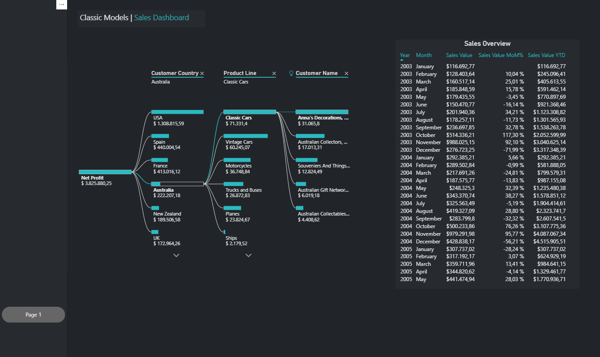
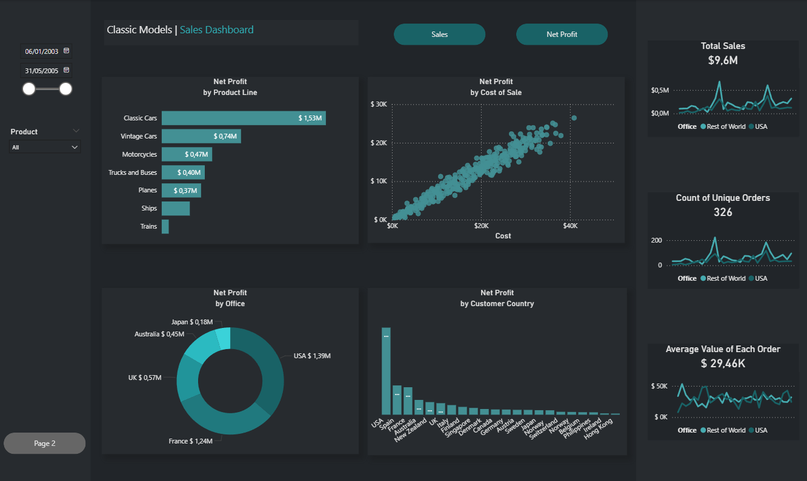

# Classic Models – SQL + Power BI Project  

This project demonstrates a complete **data analytics workflow** using the Classic Models dataset:  
1. Database creation (SQL)  
2. Data extraction & transformation (SQL queries & views)  
3. Business reporting & visualization (Power BI)  

---

## 📂 Repository Structure
- **/data**  
  - `create_classicmodels_db.sql` → Creates and populates the Classic Models database (tables, relations, sample data).  
  - `sales_data_for_power_bi.xlsx` → Excel file with sales dataset, used as an alternative source in Power BI.  

- **/queries**  
  - `second_order_per_rep.sql` → Uses a CTE with `ROW_NUMBER` to return the **second order per sales representative**.  
  - `top_customers.sql` → Finds the **top 10 customers** by total sales value.  
  - `revenue_by_region.sql` → Aggregates **revenue by office/country**.  
  - `monthly_sales_trend.sql` → Calculates **monthly revenue with month-over-month growth**.  
  - `monthly_payments_trend.sql` → Aggregates **monthly payments with MoM growth**.  

- **/views**  
  - `sales_data_view.sql` → Creates a consolidated SQL view (`sales_data_for_power_bi`) joining orders, customers, products, employees, and offices, used as the main dataset for Power BI.  

- **/dashboard**  
  - `Classic-models.pbix` → Power BI dashboard connected to the SQL dataset or Excel.  
  - `/screenshots/` → PNGs of the dashboard (**YOU MUST ADD YOUR CAPTURES HERE**).  

- **README.md** → Project documentation (this file).  

---

## 🚀 How to Run

### 1) Database
1. Open your SQL environment (e.g., MySQL or MariaDB).  
2. Run `/data/create_classicmodels_db.sql` to create and populate the Classic Models database.  

### 2) Views
3. Run `/views/sales_data_view.sql` to create the consolidated dataset (`sales_data_for_power_bi`).  

### 3) Queries
4. Explore `/queries/` scripts:  
   - Top customers  
   - Revenue by region  
   - Monthly sales & payments trends  
   - Second order per sales rep  

### 4) Power BI
5. Open `/dashboard/Classic-models.pbix` in **Power BI Desktop**.  
6. Update **Data Source Settings** → connect to your SQL server or the provided Excel.  
7. Click **Refresh** → visuals and KPIs will update.  

---

## 📊 Dashboard Highlights
- Sales performance by **region, product line, and customer**  
- **KPIs**: revenue, orders, profit margin, growth %  
- Interactive filters (time, geography)  
- Data cleaning with **Power Query**  

### Example Screenshots  
  
  

---

## 🧠 SQL Highlights

Complex joins across multiple tables.

CTE + window functions for advanced analytics.

Time series aggregation for trend analysis.

Views to simplify reporting integration with Power BI.

Example: `monthly_sales_trend.sql` → Monthly revenue with MoM growth

```sql
WITH monthly AS (
  SELECT
    DATE_FORMAT(ord.orderDate, '%Y-%m-01') AS month_start,
    SUM(od.quantityOrdered * od.priceEach) AS revenue
  FROM orders ord
  JOIN orderdetails od ON ord.orderNumber = od.orderNumber
  GROUP BY DATE_FORMAT(ord.orderDate, '%Y-%m-01')
)
SELECT
  month_start,
  revenue,
  LAG(revenue) OVER (ORDER BY month_start) AS prev_month_revenue,
  ROUND(
    (revenue - LAG(revenue) OVER (ORDER BY month_start))
    / NULLIF(LAG(revenue) OVER (ORDER BY month_start), 0) * 100, 2
  ) AS mom_growth_pct
FROM monthly
ORDER BY month_start;
```
---

## 🛠 Tech Stack
- **SQL (MySQL/MariaDB)** – database creation, queries, views  
- **Power BI** – visualization, data modeling  
- **Excel** – alternative dataset for testing  
- **Classic Models dataset** – sample business data  

---

## 🙋‍♀️ Author
Bianca Tortore
📍 Based in Berlin, Germany
🌐 Spanish | English | Italian | Learning German (A1)
🔗 [LinkedIn](https://www.linkedin.com/in/bianca-tortore-818349150/)
